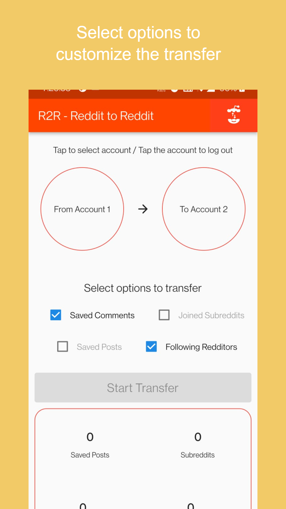

# Reddit2Reddit

A simple app to transfer saved posts, saved comments, friends, following redditors and following subreddits from one account to another.

## Screenshots

## Acknowledgements

- [Reddit](https://www.reddit.com/)
- [PRAW: The Python Reddit API Wrapper](https://praw.readthedocs.io/en/stable/)
